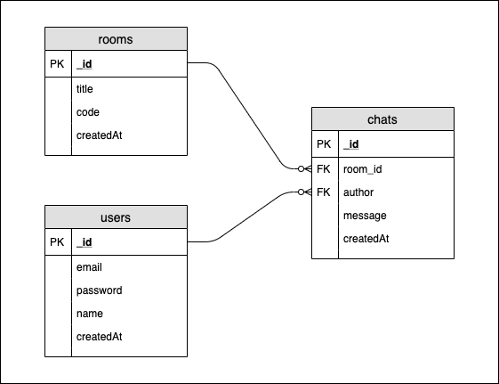

# 책상 밑의 핸드폰

> React.js, NodeJS, Socket.io를 이용한 간단한 채팅앱

## 💬 Features

#### 구현이 완료된 기능

- 로그인, 회원가입 가능
- 로그인 이후 방 생성 혹은 방 입장 입력창이 나타남
- 방을 생성하거나 방 코드를 입력하고 해당 채팅방 입장
- 상단의 로그아웃 버튼을 눌러 채팅방에서 나감과 동시에 로그아웃 가능
- 상단의 '내 정보수정' 버튼을 눌러 유저의 비밀번호, 닉네임 변경 가능
- '내 정보수정' 탭에서 하단의 '탈퇴하기' 버튼으로 탈퇴 가능
- 하단의 채팅 입력창에 채팅을 입력하고 실시간으로 대화 가능
- 내가 쓴 메세지는 오른쪽 정렬로 표시됨을 확인
- 채팅 메세지가 많아지면 자동으로 채팅방 하단의 마지막 메세지로 자동 스크롤 조정
- 채팅방 우측 사이드바에서 방제, 방 코드, 방에 있는 유저 목록 확인 가능
- 채팅방 우측 사이드바의 '방나가기' 버튼을 눌러 로그인 유지한 채 채팅방에서 나가기 가능

#### 향후 구현 될 기능

- 어드민 계정 만들고 어드민으로 유저 입장, 퇴장 시 환영 메세지 보내기
- UX / UI 개선

## 📑 Component Diagram

## 🗄️ Database Diagram

## 👩‍💻 What I learnt

- ❗Socket.io 라이브러리 활용해서 real time 채팅 앱 구현
- Client-side rendering으로 웹 서버, 웹 소켓 서버와 통신
- React.js에서 component 계층구조 연습
- MongoDB, Mongoose를 활용하여 데이터베이스 생성 및 관리
- Universal-cookie 라이브러리로 cookie 생성 및 관리

## 💻 Technologies

- Front-end: React.js, JavaScript
- Back-end: Express.js, NodeJS
- Database: MongoDB
- Libraries: Moment.js, Universal-cookie, Mongoose, Socket.io
